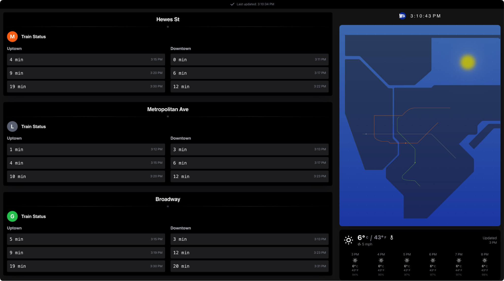

# MTA & Weather Real-Time Dashboard 🚇



This is a basic NextJS & Express project that pulls and displays real-time data from the MTA and weather APIs.

It currently utilizes [open-meteo.com](https://open-meteo.com/) for weather data and [api.mta.info](https://api.mta.info/) for MTA data.

### Running

To run this project, first start the backend server.

```bash
cd backend
npm install
npm run dev
```

Then start the frontend server.

```bash
cd frontend
npm install
npm run start
```

_You can build the frontend and backend if you plan on deploying this project via `npm run build`._
